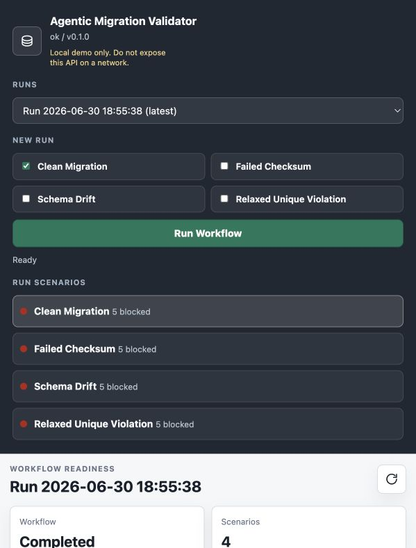

# Agentic Migration Validator

Agentic Migration Validator is a local workflow for assessing database migration readiness, validating post-migration integrity, and producing human-reviewed migration runbooks.

The core product idea is simple: advisors propose, deterministic invariants dispose. Model-backed advisors may synthesize plans, explanations, critiques, and runbooks, but database inspection, validation checks, risk scoring, evidence validation, and safety gates are deterministic.

## What It Demonstrates

- PostgreSQL source/target fixture validation with deterministic checksum and schema checks.
- Structured findings separated across `migration_integrity`, `compatibility_advisory`, and `process_control` risk axes.
- Gatekeeper decisions that enforce cutover/readiness instead of asking an advisor to decide safety.
- Evidence-bound runbook drafts whose claims must trace back to deterministic findings and gate results.
- A local dashboard that launches workflow runs, persists audit-ready state, records approvals, and resolves artifact/evidence details.

## Quickstart

Requirements:

- Python 3.11+
- Docker with Compose support
- `make`

Install test dependencies if needed:

```sh
python3 -m pip install -e ".[dev]"
```

Run the test suite:

```sh
make test
```

Start the fixture databases:

```sh
make db-up
```

Start the local API and dashboard:

```sh
make run-api
```

Open `http://127.0.0.1:8080/`.

The dashboard is dependency-free and served by the same local API process. Generated `artifacts/` and `runs/` directories are ignored by git because they are reproducible local outputs.

## Screenshot



## Dashboard Demo

Use this path when showing the project to a reviewer:

1. In `New Run`, select `Failed Checksum`, then run the workflow.
2. Confirm the new run is selected in `Runs`.
3. Inspect `Run Result`, `Workflow Progress`, and `Stage Transitions`.
4. Open `Readiness Gates` and verify cutover/readiness are blocked by deterministic findings.
5. Open `Run Artifacts`, choose the runbook draft, and inspect its evidence references.
6. Submit a validation approval in `Approval Action`.
7. Confirm `Approval State` and `Audit Trail` update while gate decisions remain derived state.

For the schema-risk contrast, launch or inspect:

- `Schema Drift`: dropped uniqueness remains a low structural note when row data still satisfies uniqueness.
- `Relaxed Unique Violation`: the same relaxed uniqueness becomes a high blocking finding when row data contains duplicates.

That contrast is the central thesis of the project: metadata identifies where a verdict is needed, row data determines whether migration integrity is actually broken, and gates own the safety decision.

## Current Status

The deterministic validation spine is implemented. The product requirements and architecture contracts are drafted, risk scoring is available, checksum validation runs against Docker PostgreSQL fixtures, eval matching is calibrated, schema introspection emits structured findings, gatekeeper checks enforce cutover/readiness state, runbook drafts remain evidence-bound, local workflow runs persist API-readable state with audit events and artifact snapshots, approvals persist as auditable run inputs, workflow responses include deterministic stage transition checks, readiness views recompute gates from persisted approvals plus fixture findings, and the local dashboard exposes workflow launch, run history, result/progress summaries, approval submission, runbook, evidence, artifact, and audit drilldowns.

Implemented capabilities:

- Axis-aware risk scoring in `tools/risk_scoring.py`
- Canonical row and table checksums in `tools/checksum.py`
- Checksum validation findings in `tools/checksum_validation.py`
- Detection eval matching in `tools/eval_runner.py`
- Raw schema introspection and diffing in `tools/schema_introspection.py` and `tools/schema_diff.py`
- Axis-first schema delta policy mapping in `tools/schema_policy.py`
- Schema-triggered data checks for relaxed nullability and dropped unique constraints
- Deterministic cutover/readiness gate checks in `tools/gatekeeper.py`
- Evidence-bound runbook draft generation in `tools/runbook_advisor.py`
- Optional live model prose for runbook drafts in `tools/live_model.py`
- Reproducible local artifact bundles in `artifacts/`
- Artifact metadata, hashing, and validation in `tools/artifacts.py`
- Evidence registry generation and reference resolution for artifact bundles
- Dependency-free local JSON API surface in `tools/api.py`
- Local workflow run response in `tools/workflow.py`
- Audit event validation in `tools/audit.py`
- Local workflow run, audit-log, and artifact-snapshot persistence in `tools/run_store.py`
- Human approval records and pending/effective approval state in `tools/approvals.py`
- Explicit stage transition checks in `tools/transitions.py`
- Approval-aware readiness views in `tools/readiness.py`
- Local dashboard in `ui/` with workflow launch, run history, result/progress/transition summaries, approval controls, readiness, artifact, evidence, and audit drilldowns
- Risk scoring test vectors in `docs/risk-scoring-test-vectors.md`
- Unit tests in `tests/`
- Foundation specs for architecture, findings, evidence references, gatekeeper invariants, fixtures, artifacts, audit events, and the initial API
- Docker Compose fixture databases for `source-postgres` and `target-postgres`
- Seed fixtures for `clean_migration`, `failed_checksum`, `schema_drift`, and `schema_relaxed_unique_violation`

Not implemented yet:

- Additional data validation detectors beyond checksum
- Full FastAPI backend
- Fuller backend workflow orchestration and async progress streaming

## MVP Scope

The MVP validates a real PostgreSQL-to-PostgreSQL migration while also reporting separate advisory risks against a Snowflake-like target profile.

Risk is separated into three axes:

- `migration_integrity`: whether the PostgreSQL migration being validated is correct
- `compatibility_advisory`: prospective warehouse compatibility concerns
- `process_control`: approvals, rollback criteria, evidence references, and governance

PostgreSQL cutover readiness reads only `migration_integrity` and `process_control`. Compatibility advisory findings are reported separately and cannot block PostgreSQL cutover readiness.

## Repository Map

```text
docs/
  assets/
    dashboard-overview.png
  api-contract.md
  architecture.md
  artifact-schemas.md
  audit-events.md
  demo-script.md
  evidence-references.md
  fixture-plan.md
  gatekeeper-invariants.md
  product-requirements.md
  risk-scoring-test-vectors.md
  runbook-advisor-boundary.md
  security-audit.md
  structured-finding-schema.md
tests/
  test_api.py
  test_approvals.py
  test_artifacts.py
  test_audit.py
  test_checksum.py
  test_checksum_validation.py
  test_eval_runner.py
  test_fixtures.py
  test_gatekeeper.py
  test_risk_scoring.py
  test_readiness.py
  test_runbook_advisor.py
  test_run_store.py
  test_schema_diff.py
  test_schema_introspection.py
  test_schema_policy.py
  test_static_ui.py
  test_transitions.py
  test_workflow.py
tools/
  api.py
  approvals.py
  audit.py
  artifacts.py
  checksum.py
  checksum_validation.py
  eval_runner.py
  gatekeeper.py
  risk_scoring.py
  readiness.py
  runbook_advisor.py
  run_store.py
  schema_diff.py
  schema_introspection.py
  schema_policy.py
  transitions.py
  workflow.py
fixtures/
  base/
  scenarios/
ui/
  index.html
  styles.css
  app.js
scripts/
  diff_schema.py
  generate_runbook.py
  run_eval.py
  serve_api.py
  run_workflow.py
  write_artifacts.py
  reset_databases.sh
  validate_scenario.py
docker-compose.yml
Makefile
pyproject.toml
```

## Foundation Docs

| Deliverable | Status |
| --- | --- |
| README draft | Done |
| Architecture doc | Done |
| Fixture plan | Done |
| Initial API contract | Done |
| Gatekeeper invariant spec | Done |
| Evidence-reference spec | Done |
| Structured finding schema with `record_type`, `risk_axis`, and `finding_key` | Done |
| Artifact schemas | Done |
| Audit event schema | Done |
| Demo script | Done |

## Development

Use the project-local test command:

```sh
make test
```

Equivalent direct command:

```sh
python3 -m pytest -q
```

Start the fixture databases:

```sh
make db-up
```

Load the clean scenario:

```sh
make db-reset
```

Load the failed-checksum scenario:

```sh
make db-reset SCENARIO=failed_checksum
```

Run checksum validation for a scenario:

```sh
make validate-scenario SCENARIO=failed_checksum
```

Run raw schema diff introspection for a scenario:

```sh
make schema-diff SCENARIO=schema_drift
```

Run deterministic fixture evals:

```sh
make eval-scenarios
```

The eval report includes `can_recommend_cutover` and `can_mark_ready` gate results for each fixture scenario.

Write a local artifact bundle:

```sh
make write-artifacts
```

This writes a validated eval report and runbook drafts under `artifacts/`. The generated directory is ignored by git because artifacts are reproducible local outputs.
The bundle includes an evidence registry so artifact evidence refs resolve to stored bundle entries.

Run the local fixture workflow:

```sh
make run-workflow
```

This emits an API-shaped workflow response with step status, scenario IDs, artifact refs, stage transition checks, workflow validation, audit validation, run-state metadata, and the artifact manifest. It writes generated state under `runs/`, which is ignored by git.

Serve the local JSON API:

```sh
make run-api
```

The same server renders the local dashboard at `http://127.0.0.1:8080/`. The dashboard launches fixture workflows, shows workflow result/progress/transition summaries, workflow readiness, approvals, blocking findings, persisted runs, artifact snapshots, evidence references, runbook sections, and selected audit-event details from the JSON routes below. Approval controls submit auditable records through the API; gate outputs remain derived state.

Implemented routes:

- `GET /`
- `GET /ui/{asset}`
- `GET /health`
- `GET /scenarios`
- `GET /artifacts/latest-manifest`
- `GET /artifacts/{artifact_id}`
- `GET /evidence/{evidence_ref}`
- `GET /workflows`
- `GET /workflows/latest`
- `GET /workflows/{workflow_run_id}`
- `GET /workflows/{workflow_run_id}/artifacts/{artifact_id}`
- `GET /workflows/{workflow_run_id}/evidence/{evidence_ref}`
- `GET /workflows/{workflow_run_id}/audit`
- `GET /workflows/{workflow_run_id}/approvals`
- `GET /workflows/{workflow_run_id}/readiness`
- `POST /workflows/{workflow_run_id}/approvals`
- `POST /workflows/run`

Smoke-test the running local API:

```sh
make api-smoke
```

With Docker fixtures running, smoke-test the workflow and retrieval routes:

```sh
SMOKE_WORKFLOW_SCENARIO=failed_checksum make api-smoke
```

Enforce one gate for one scenario:

```sh
make enforce-gate SCENARIO=clean_migration GATE=can_mark_ready
```

This command exits nonzero when the gate is blocked.

Generate a deterministic runbook draft for one scenario:

```sh
make draft-runbook SCENARIO=failed_checksum
```

Live model prose is opt-in and still passes through boundary validation:

```sh
RUNBOOK_MODEL_CALLS=enabled OPENAI_API_KEY=... OPENAI_MODEL=... make draft-runbook SCENARIO=failed_checksum
```

The default portfolio demo is credentials-free; live generation has not been executed in this repository because no API key is required for the deterministic safety checks. The boundary is validated deterministically against adversarial prose, so the safety property does not depend on model behavior.

The live path uses deterministic gate results as the source of truth. If generated prose makes unsupported causal claims, boundary validation fails and the command exits nonzero.

Stop the fixture databases:

```sh
make db-down
```

## Demo Walkthrough

Run the deterministic fixture suite:

```sh
make eval-scenarios
```

The command resets Docker-managed source and target PostgreSQL databases for each scenario, runs checksum validation, runs schema introspection and schema-triggered data checks, compares produced findings to expected findings, and evaluates cutover/readiness gates. Model calls are disabled.

The four implemented scenarios show the core pattern:

| Scenario | What It Proves | Cutover/Ready |
| --- | --- | --- |
| `clean_migration` | Source and target data/schema match. No detector findings are emitted. | Allowed |
| `failed_checksum` | Data content drift is caught by canonical checksums even when row counts match. | Blocked |
| `schema_drift` | Schema differences can be structural or advisory without corrupting migrated data. Relaxed guarantees trigger row-data checks, and clean row data stays non-blocking. | Allowed |
| `schema_relaxed_unique_violation` | The same relaxed unique constraint becomes a blocking integrity finding when target row data contains duplicates. | Blocked |

Read each scenario result through three fields:

- `validation_findings`: row/data validation findings, such as canonical checksum mismatches.
- `schema_findings`: catalog-level findings, such as widened types, relaxed constraints, or extra target columns.
- `schema_data_check_results`: row-data checks triggered by schema relaxation, such as duplicate checks after a unique constraint is dropped.
- `gate_results`: deterministic `can_recommend_cutover` and `can_mark_ready` decisions, including the specific blocking finding keys.

The important distinction is visible in the two schema scenarios. `schema_drift` drops a unique constraint but keeps payment references unique, so it emits a low structural finding and the duplicate check passes. `schema_relaxed_unique_violation` drops the same constraint and introduces duplicate payment references, so the triggered data check emits a high blocking validation finding.

That is the central design boundary: detectors and data checks produce structured facts; the gatekeeper decides whether those facts block cutover/readiness; future advisors may explain or summarize, but they do not decide safety.

To exercise the gatekeeper as a hard stop, run:

```sh
make enforce-gate SCENARIO=failed_checksum GATE=can_mark_ready
```

That command exits nonzero because the checksum mismatch blocks readiness. The same command with `SCENARIO=clean_migration` exits successfully.

## Next Milestone

The next milestone should improve production-like orchestration depth without weakening the deterministic boundary:

- Add richer runtime failure recovery and retry handling.
- Add optional async workflow progress streaming if the stdlib API starts limiting the demo.
- Consider replacing the stdlib server with a FastAPI backend only if it preserves the same contracts and static UI
- Keep gate outputs derived from state, never edited directly

## Design Boundary

MCP is intentionally deferred to phase two. The MVP should use direct Python tool calls through typed internal functions so the same capabilities can later be exposed through MCP without changing detector logic.
